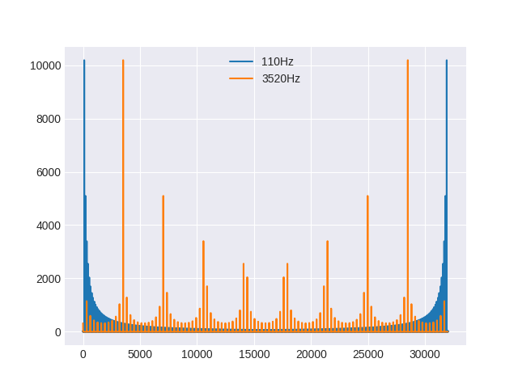

I'd like to talk about a subject close to my heart.  Yes, it's about terrible noises, and the synthesizing of terrible noises.  In subtractive synthesizers you're really going to want a harmonically-complex waveform (so, not a sine wave then), and a filter to "subtract" the harmonics you don't want.  A sawtooth wave is a good start, because its harmonics can be described as "1/f" - that is to say, the second harmonic is half the amplitude of the fundamental, the third is 1/3, the fourth is 1/4 and so on.  Loads of harmonics, and easy to generate in an analogue synth too - just arrange to charge a capacitor up, and when it reaches a certain voltage you discharge it by shorting it out with a transistor.  More current means faster charging so a higher frequency, and the voltage comparison means the output amplitude stays the same.

Okay, so we ought to be able to do that digitally, right?  We'd just have a counter that goes from -1 to 1, and every time we generate a sample add an amount to it based on the frequency we want and the sample rate, right?

Let's try it: `placeholder for link to code`

We get something that sounds like this Middle A:

<label for="110Hz">110Hz (A2) sawtooth</label>
 
<audio id="110Hz" controls src="media/110hz.ogg">Your browser doesn't support this audio clip</audio>

and if we generate a higher-pitched note, we get:

<label for="880Hz">A5 (880Hz) sawtooth</label>
 
<audio id="880Hz" controls src="media/880hz.ogg">Your browser doesn't support this audio clip</audio>

Urgh.  That doesn't sound like a sawtooth at all.  What's going on?

Aliasing.

If you've played with sampling before you'll know you need to lowpass filter the input at less than half the sampling rate, or you get aliasing.  If you generate a signal digitally (or really, in discrete time steps - an analogue sample-and-hold would do the same thing, like those bloody BBD chips) then you're going to end up at some point with harmonics that have significant energy and are above that magic Nyquist frequency.  Let's `placeholder` adapt our waveform generator script so we can plot pretty pictures.

Straight away you can see the 110Hz curves down nicely towards the middle (Nyquist), and the 3520Hz A7 (I deliberately picked an even higher frequency to make it look worse) starts further up the spectrum and if you imagine a line from the topmost orange peak on the left, the fundamental, curving down and right you can see how it would "cross over" its reflection like a bowtie shape.  Those "extra" spikes are what give us the clangy noise because they are not harmonically related to our desired signal.

So, what can we do about it?

